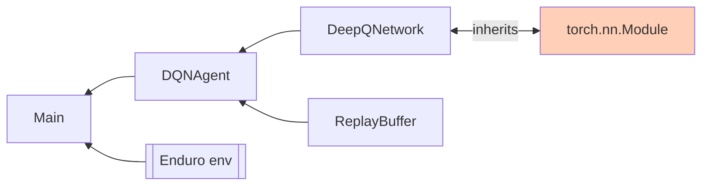

## Flowchart

```mermaid
flowchart RL
    D[torch.nn.Module]:::someclass <--> |inherits| C[DeepQNetwork]
    A[DQNAgent] --> B[Main]
    C[DeepQNetwork] --> A
    E[ReplayBuffer] --> A
    F[[Enduro env]] --> B
    classDef someclass fill:#f967
```
